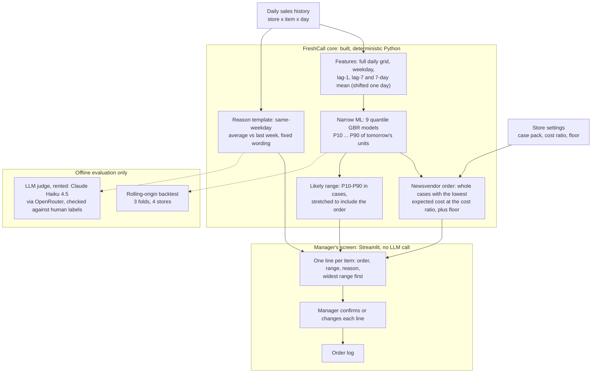

# FreshCall: product documentation

FreshCall is a next-day ordering copilot for fresh food. Every evening it
gives the person placing tomorrow's fresh order a suggested order for each
item, in whole cases, with the likely range and a one-line reason. The
person confirms or changes each line. FreshCall never places an order by
itself.

This page covers who it is for, what goes in, what comes out, how the
pieces fit, and which metrics were targeted and reached. The full
evidence trail is in [`DECISIONS.md`](../DECISIONS.md). The data and the
evaluations each have their own explainer: [`DATA.md`](./DATA.md),
[`EVALS.md`](./EVALS.md).

## Persona

**The manager who places tomorrow's fresh order at a fresh-food business:
a supermarket's fresh section or a fast-food (QSR) restaurant.**

- Orders about 40 short-shelf-life items every evening, at the end of the
  shift, usually on a phone. That is roughly 14,600 ordering decisions per
  store per year.
- Today copies what sold on the same day last week, then rounds up to whole
  cases. This gives one number with no sense of how far to trust it, and
  whatever is over-ordered is thrown away.
- Has never seen a prediction interval and will not open a second screen.
- Knows things the data does not: a local event, a promotion, a late
  delivery. Changing a suggestion is normal use, not a system failure.

Design constraints that follow from this persona (Problem Statement v3,
section 3):

1. One screen, quantities in cases.
2. No confidence number anywhere on screen; uncertainty is shown as a
   range in cases, or in words when the range is too wide to act on.
3. Every line can be changed, and the manager confirms every line.

**Validation note.** The data is a supermarket chain's (Kaggle Favorita),
because I found no public QSR dataset with daily item-level sales. The ordering problem is
the same shape in both businesses: perishable items, whole cases, daily
orders, waste versus running out.

## Input

| Input | Where it comes from | Example |
|---|---|---|
| Daily unit sales per item per store | the store's sales history (here: Favorita `train.csv`, perishable items only) | store 45, item 108698, 2017-07-16, 23 units |
| Item category | item master (here: `items.csv`) | item 108698 → DELI |
| Case pack | store setting, `config.yaml` (assumed 12; Favorita has none) | 12 units per case |
| Cost ratio | store setting, chosen by the business, `config.yaml` (default 4) | "running out is 4x worse than wasting" |
| Minimum-order floor | store setting, on by default | sold on each of the last 7 days → at least 1 case |
| The manager's own knowledge | the manager, at order time | "school holiday tomorrow: order 2 more cases of milk" |

No personal data is used. On-hand stock is not an input, because Favorita
has no inventory field (see Limits).

## Output

For each item, on one screen:

- **Tomorrow's order in whole cases and units**, e.g. `ORDER 3 cases (36 units)`.
  This is the newsvendor order: the case count with the lowest expected
  cost at the store's cost ratio.
- **The likely range in cases**, e.g. `likely 1–5`, drawn as a bar with a
  dot at the order. Ranges wider than 4 cases are shown in words instead.
- **A one-line reason** built from a fixed template, e.g.
  `Tuesdays have averaged 19.8 units, lower than last Tuesday's 45.`
- **Order of the list:** widest range first, so attention goes where the
  model is least sure. Slow, routine items are folded into a "standing
  orders" block.
- **Place order:** writes each line as confirmed or changed to an order
  log (`data/ui_orders_log.csv`). Nothing is sent to a supplier.

The manager's screen makes no LLM call and shows no confidence score.

## Architecture

**External components (rented or reused).**

| Component | What it is | Where it is used | Own or rent |
|---|---|---|---|
| scikit-learn `GradientBoostingRegressor` | library | the 9 quantile forecasts | rent the algorithm (default hyperparameters, not tuned); own the features, folds and ordering rule |
| pandas, NumPy | libraries | data handling | rent |
| Streamlit, Altair | libraries | the manager's screen and the Results charts | rent |
| Claude Haiku 4.5 via OpenRouter | LLM (API) | judge in the evaluation only (E9, E10, E13) | rent |
| gpt-4o-mini via OpenRouter | LLM (API) | wrote the reason sentence in v1/v2; retired, kept only for the evaluation record | rent (retired) |
| Kaggle Favorita | dataset | all training and testing | reuse ([`DATA.md`](./DATA.md)) |

No agent framework, vector store or other tool is used.

**Build versus rent.** The forecasting and the ordering logic are the
product, so they are built and unit-tested (156 tests). Apart from
open-source libraries, the only rented component is an LLM, used offline as
one part of the evaluation. An
earlier version had an LLM write each reason sentence; it was replaced by
a template because an LLM kept choosing words like "significantly" with
nothing checking the size of the gap, and could not apply a numeric rule
("about the same" within 10%) reliably ([`EVALS.md`](./EVALS.md), E9–E13).

**Not in the architecture, on purpose:** RAG (there is no document corpus;
the facts are numbers) and an agent (the task is one pass, history →
forecast → order → sentence).

## Metrics targeted and reached

All results come from scripts in this repository on real Favorita data,
on stores the design was not tuned on unless marked "dev". "Per night"
means per 40-item ordering night. Script and decision-log entry for each
row: [`EVALS.md`](./EVALS.md).

### The original targets (Problem Statement v3), and what happened

The first design ordered only when the model was sure and handed the
rest back to the manager as "ASK ME".

| Metric targeted | Target | Reached | Verdict |
|---|---|---|---|
| Forecaster vs last week: relative improvement in Case Match Rate | ≥ 15% | +4% to +12% on store 44 (dev); +15.4% on store 49 at one threshold; +14.6% / +20.0% without discontinued items | **Not met** as defined. Around the target, store-dependent |
| Abstain rate (items handed back) | about 15% | 58% to 94% across every threshold tested (v1); 74% to 78% (v2) | **Not met** |
| Abstention precision vs random (the stated abandon condition) | better than random | v1: 0.87x to 1.01x, replicated on store 49. v2: 1.26x on store 49 | **v1 failed, so it was abandoned.** v2 passed, but handed back three quarters of the items |
| Interval calibration (P10–P90 contains actual) | 80% nominal | 77.6% (store 44) | Close, slightly under |
| Every numeral in a sentence is in the fact block (L1) | zero tolerance | 14/14 LLM sentences, 14/14 template sentences | **Met** |
| Minimal end-to-end slice (units a multiple of the case pack; abstain text has no quantity) | all checks pass | all pass, on real data and on synthetic demo data | **Met** |

**What changed the direction.** Measuring what a manager would actually
experience on store 44 (dev): copying last week gives 15.5 wrong orders
per night; the v2 ASK ME design gives 15.2 and about 16 minutes; letting
the model answer every item gives 13.1 in about 3 minutes. Handing an item
back to someone with no extra information makes the order worse, so the
abstain design was dropped.

### The redesign and the ordering rule (pre-registered before each test)

| Metric targeted | Target | Reached | Verdict |
|---|---|---|---|
| v3 (order + likely range for every item) vs last week, items that need judgement, store 8 | fewer wrong orders and lower unit error, in ≥ 2 of 3 folds | wrong orders 13.3 → 10.3 per night; units wasted −11%; units short −26%; **3 of 3 folds** | **Met** |
| Range is honest: needed cases inside the shown range | (descriptive) | 94.8% (store 8); widest-range quarter holds 45% of wrong orders (25% if width meant nothing) | Range points attention at the right lines |
| Newsvendor order vs the old P50 order, cost per night, store 45 | cheaper, pooled and in ≥ 2 of 3 folds, at every cost ratio | cheaper at all 6 ratios, 3/3 folds each: −6% / −4% / −18% at ratios 2 / 4 / 9; −21% to −35% vs last week | **Met** (ratios below 2 not quoted, see Limits) |
| Reason sentence (template): numbers, comparison word, units, human check | all 14 cases pass | 14/14 on every check; Harry "yes" on all 14 | **Met** |
| Manager time vs today | less time | 2.3 to 8.4 min vs 13 to 30 min, under all 9 timing assumptions tested | Holds, but **timings are assumptions**, never measured |
| LLM judge catches deliberately broken sentences | catches them, no false alarms | 5 of 6 caught, 0 false alarms; agrees with the human on "direction" only 7/14 | Useful as a screen only |
| Cost to serve | trivial | 0 LLM calls on the manager's screen; all LLM work in the project ≤ USD 1.11 | **Met** |

### Self-check on the numbers

A deliberate leak test (one missing `shift(1)` in a feature) pushed the
forecaster's improvement from +11.8% to +20.7%, a fake pass of the 15%
target. The unit tests catch that bug; the calibration check would not
have (coverage moved only 77.6% → 78.3%). Reported numbers are the clean
ones.

## Limits

- **No inventory data.** Every day starts from zero stock, so waste is
  overstated for every policy on slow items, and at cost ratios below 2
  the newsvendor saving comes mostly from ordering nothing (up to 64% of
  days at ratio 0.25). This validates forecasting, how uncertainty is
  shown, and the ordering rule, not ordering with real inventory.
- **Assumptions:** case pack 12 for every item, all manager timings.
- **Not measured:** what a real manager knows that the model does not.
  Every v3 result assumes the manager accepts every suggestion.
- **Not built:** detection of one-off events such as a local promotion.
- **Responsible use:** advisory only, always human-confirmed, never
  submits an order, never used for food-safety decisions (shelf life,
  hold and discard times). This follows the human-oversight principle in
  Singapore's IMDA Model AI Governance Framework.
